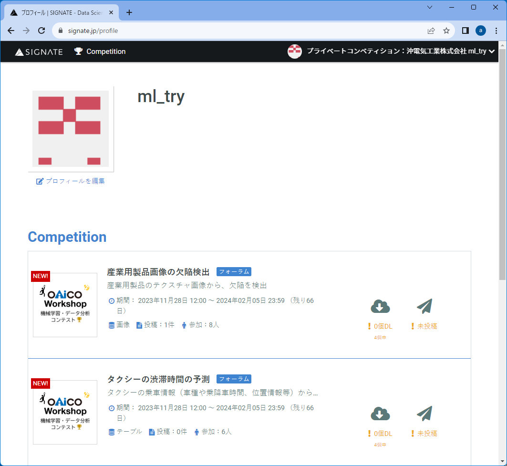

# ソフトウェア開発者Day　2023  
  

  

# 機械学習・データ分析コンテスト  
今年も、機械学習やデータ分析の実践の場として機械学習・データ分析コンテストを開催します。  

## コンテスト概要  
● コンテスト名：機械学習・データ分析コンテスト  
● 主催：機械学習・データ分析コンテスト運営  

**参加方法・詳細のリンクはこちら→：　[ソフトウェア開発者Day　OAICO Workshop　機械学習・データ分析コンテスト](http://www-fsc.oii.oki.co.jp/warabi/devdays/mlcontest/mlcontest_preview.html)**  

## 機械学習モデリング  
**課題1． 産業用製品画像の欠陥検出（画像検出）**  
欠陥品の検査の過程を自動化することができれば、品質保証のコストを大幅に削減できます。  
提供されるデータは、産業用製品のテクスチャ画像です。 画像から製品に欠陥があるかどうか判別するモデルの作成にチャレンジしていただきます。  
**ここでは、この課題のチュートリアルをご紹介します。**  
  
**課題2．レンタル自転車の利用者数予測（テーブル・回帰)** 　**★★★更新★★★**  
気象情報等の時系列データ等から、1時間ごとのレンタル自転車の利用者数を予測しよう！  
提供されるデータは、2年間分の季節情報、気象情報です。  
  
**課題3．スパムメールの判別（自然言語）**  
電子メールのテキストデータ（英語）から、メールがスパムか否かを判別しよう！  
初の自然言語処理を利用した課題になります。  
「スパムメール分類」は文書分類で、もっとも代表的な実用事例です。  
機械は人間のように言葉の意味を容易には理解・処理できないため、前処理が重要です。  
自然言語処理独特な工夫や、言語データのデータ処理の仕方を試行錯誤してみてください。  
  
## データ分析・アイデアソン  
**課題1．キャッシュレス推進の課題を分析し、ビジネスアイデアを考えよう**  
都内のキャッシュレス推進に関する調査アンケート結果と、参加者が探したデータを元にキャッシュレス推進の課題を分析し、ビジネスアイデア考えてください。  
  
**課題2．オープンデータからビジネスアイデアを自由に考えよう**  
デジタル庁や東京都などでは、さまざまなオープンデータを公開しています。  
それらのオープンデータからビジネスに活用できるデータを探し、ビジネスアイデアを考えてもらいます。  

# コンテスト参加方法  
参加登録方法はこちら  
**参加方法・詳細のリンクはこちら→：　[ソフトウェア開発者Day　OAICO Workshop　機械学習・データ分析コンテスト](http://www-fsc.oii.oki.co.jp/warabi/devdays/mlcontest/mlcontest_preview.html)**  

## コンテストアクセス方法  
コンテスト参加登録後に届くメールに記載された  
サインインはこちら：[ https://biz.quest.signate.jp/biz_users/sign_in](https://biz.quest.signate.jp/biz_users/sign_in)
をブラウザで表示します。  
  
### ● SIGNATE Cloudにサインイン  
コンテスト参加登録時に設定した、メールアドレス・パスワードを入力して、「サインイン」ボタンをクリックします。  

   
  
### ● Competition画面表示  
本年度開催中のコンテスト一覧が確認できます。  

   
  
### ● 課題画面表示  
アイコンをクリックすると、課題の概要が表示されます。  

   
  
### ● データ取得方法  
『データ』タブをクリックすると、データダウンロード画面が表示されます。  
ダウンロードのアイコンをクリックして、ファイルをダウンロードします。  

  

# 参考  
チュートリアル実行（Pythonプログラム実行）可能なGoogleColabの使い方を共有しています。  
[GoogleColab](https://gitlab.intra.oki.co.jp/ai-lecture-deeplearning/googlecolab)
